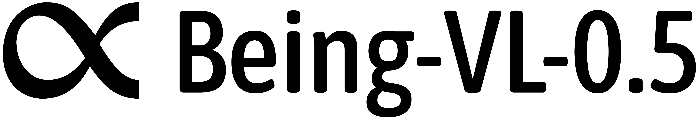
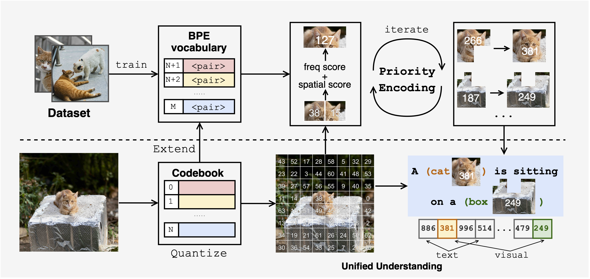

# Unified Multimodal Understanding via Byte-Pair Visual Encoding

<p align="center">
    
<p>

<div align="center">

[](https://beingbeyond.github.io/Being-VL-0.5)
[](https://arxiv.org/abs/2506.23639)
[]()

</div>



Multimodal large language models (MLLMs) have made significant progress in vision-language understanding, yet effectively aligning different modalities remains a fundamental challenge. We present a framework that unifies multimodal understanding by applying byte-pair encoding to visual tokens. Unlike conventional approaches that rely on modality-specific encoders, our method directly incorporates structural information into visual tokens, mirroring successful tokenization strategies in text-only language models. We introduce a priority-guided encoding scheme that considers both frequency and spatial consistency, coupled with a multi-stage training procedure based on curriculum-driven data composition. These enhancements enable the transformer model to better capture cross-modal relationships and reason with visual information. Comprehensive experiments demonstrate improved performance across diverse vision-language tasks. By bridging the gap between visual and textual representations, our approach contributes to the advancement of more capable and efficient multimodal foundation models.

## News

- **[2025-06-26]**: 🎉🎉 We publish **Being-VL-0.5**, which is accepted by ICCV 2025 ! Check our paper [here](https://arxiv.org/abs/2506.23639). The code and training scripts will be released soon.
- **[2025-01-23]**: 🎉🎉 **Being-VL-0** is accepted by ICLR 2025! Check our paper [here](https://openreview.net/pdf?id=3TnLGGHhNx).
- **[2024-10-03]**: We publish **Being-VL-0**, the first version of **Being-VL** series.


## Code
We will release our code and training scripts soon.

## Citation
If you find our work useful, please consider citing us!

**Being-VL-0.5**

```bibtex
@inproceedings{zhang2025beingvl05,
  title={Unified Multimodal Understanding via Byte-Pair Visual Encoding},
  author={Wanpeng Zhang and Yicheng Feng and Hao Luo and Yijiang Li and Zihao Yue and Sipeng Zheng and Zongqing Lu},
  booktitle={Proceedings of the IEEE/CVF International Conference on Computer Vision},
  year={2025}
}
```

**Being-VL-0**

```bibtex
@inproceedings{zhang2025beingvl0,
  title={From Pixels to Tokens: Byte-Pair Encoding on Quantized Visual Modalities},
  author={Wanpeng Zhang and Zilong Xie and Yicheng Feng and Yijiang Li and Xingrun Xing and Sipeng Zheng and Zongqing Lu},
  booktitle={The Thirteenth International Conference on Learning Representations},
  year={2025},
  url={https://openreview.net/forum?id=3TnLGGHhNx}
}
```